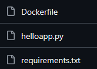

# Challenge 1 – Build and Push a Container Image Using CI/CD

This challenge focuses on building a complete CI/CD workflow that automatically builds and pushes a Docker image to Docker Hub using GitHub Actions. 

## Objective

Create a simple application, containerize it with a Dockerfile and automate the build‑and‑push process using GitHub Actions.

## What I Built

- A basic Python application (`helloapp.py`). 
- A Dockerfile to containerize the app.
- A GitHub Actions workflow that: 
    - Checks out the repository, 
    - Logs in to Docker Hub using GitHub Secrets, 
    - Builds the Docker image, 
    - Pushes the image to Docker Hub automatically on every push.

## Folder Structure

## CI/CD Workflow Summary

- Trigger: Any `push` to the repository
- Tools used: GitHub Actions, Docker Hub
- Steps executed:
  - Checkout → Login → Build → Push

## Key Learnings

- Understanding Docker build contexts and file paths. 
- Managing Docker Hub PAT tokens and scopes.  
- Structuring GitHub Actions workflows.  
- Reading and debugging CI/CD logs effectively.

## Outcome

Every push now automatically produces a fresh Docker image in Docker Hub, demonstrating a complete CI/CD pipeline from source code to container registry.

